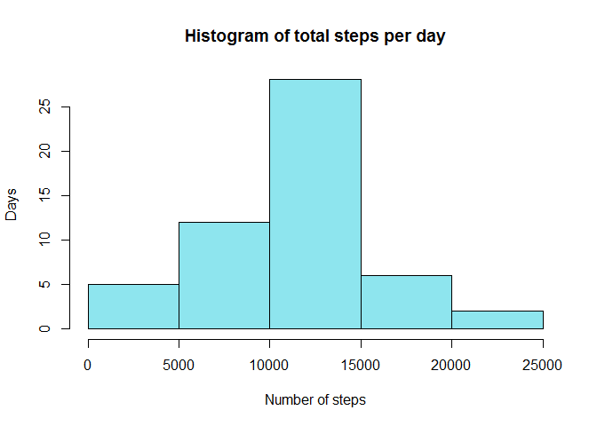
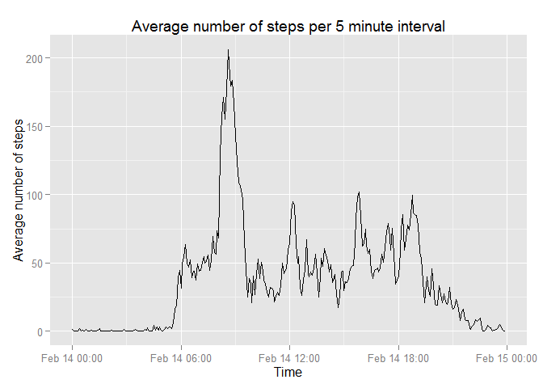

# Reproducible Research: Peer Assessment 1
Set locale so that names of weekdays appear in English,

```r
Sys.setlocale("LC_TIME", "C")
```
and load the neccessary libraries.

```r
library(data.table)
library(ggplot2)
```


## Loading and preprocessing the data
Extract the 'activity.csv' file from the zipfile.

```r
unzip(zipfile = 'activity.zip')
```
Read data into a data table and convert the date into POSIXct.

```r
activityData <- fread('activity.csv')
activityData[, date := as.POSIXct(activityData[, date], format="%Y-%m-%d")]
```


## What is mean total number of steps taken per day?
Aggregate the total number of steps per date into the variable 'totalSteps',

```r
stepsPerDay <- activityData[, list(totalSteps = sum(steps)), by = date]
```
plot a histogram,

```r
hist(stepsPerDay$totalSteps, 
     col  = 'Red',
     main = 'Histogram of total steps per day',
     xlab = 'Number of steps',
     ylab = 'Days'
)
```

 

and calculate mean and median of steps per day.

```r
meanStepsPerDay   <- as.integer(stepsPerDay[, mean(totalSteps, na.rm = TRUE)])
medianStepsPerDay <- stepsPerDay[, median(totalSteps, na.rm = TRUE)]
```
Mean number of steps per day: 10766.   
Median number of steps per day: 10765.

## What is the average daily activity pattern?
Aggregate the mean number of steps per 5 minute interval into the 
variable 'avgSteps' and ignore NAs for now. Convert the interval into an extra 
'time' variable. Since there is no time in R without date, the current date is
used as date for that variable. Keep the (now redundant) 'interval' variable 
since it is needed later to fill in the NAs. 

```r
dailyActivity <- activityData[, 
                              list(avgSteps = mean(steps, na.rm = TRUE)), 
                              by = interval
                 ]
dailyActivity[, 
              time := as.POSIXct(sprintf("%05.2f", 
                                         dailyActivity$interval/100
                                 ), 
                                 format = "%H.%M"
                      )
]
```

```
##      interval  avgSteps                time
##   1:        0 1.7169811 2015-02-13 00:00:00
##   2:        5 0.3396226 2015-02-13 00:05:00
##   3:       10 0.1320755 2015-02-13 00:10:00
##   4:       15 0.1509434 2015-02-13 00:15:00
##   5:       20 0.0754717 2015-02-13 00:20:00
##  ---                                       
## 284:     2335 4.6981132 2015-02-13 23:35:00
## 285:     2340 3.3018868 2015-02-13 23:40:00
## 286:     2345 0.6415094 2015-02-13 23:45:00
## 287:     2350 0.2264151 2015-02-13 23:50:00
## 288:     2355 1.0754717 2015-02-13 23:55:00
```
Plot the average number of steps per 5 minute interval. Ignore the date in the
x-axis. I was unable to get rid of it in ggplot2. The assignment would also
be o.k. if I just used the interval numer for the x-axis.

```r
g <- qplot(time, 
           avgSteps, 
           data   = dailyActivity, 
           geom   = 'line',
           xlab   = 'Time',
           ylab   = 'Average number of steps'
)
gTitle <- 'Average number of steps per 5 minute interval'
print(g + ggtitle(gTitle))
```

 

Find the interval containing the average maximum number of steps.

```r
intervalOfMaxSteps <- dailyActivity[which.max(dailyActivity$avgSteps), interval]
```
The average maximum number of steps are in interval 835.


## Imputing missing values


## Are there differences in activity patterns between weekdays and weekends?
