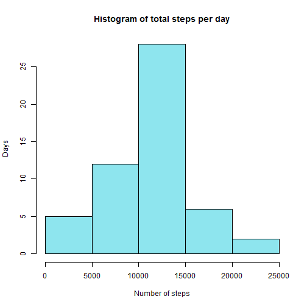
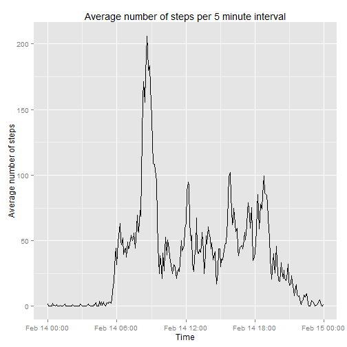
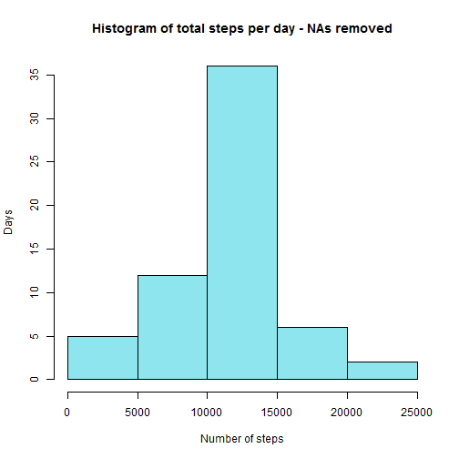
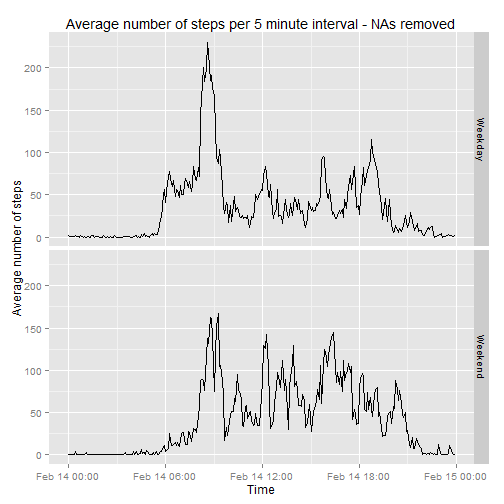

Set locale so that names of weekdays appear in English,

```r
Sys.setlocale("LC_TIME", "C")
```
and load the neccessary libraries.

```r
library(data.table)
library(ggplot2)
```


## Loading and preprocessing the data
Extract the 'activity.csv' file from the zipfile.

```r
unzip(zipfile = 'activity.zip')
```
Read data into a data table and convert the date into POSIXct.

```r
activityData <- fread('activity.csv')
activityData[, date := as.POSIXct(activityData[, date], format="%Y-%m-%d")]
```


## What is mean total number of steps taken per day?
Aggregate the total number of steps per date into the variable 'totalSteps',

```r
stepsPerDay <- activityData[, list(totalSteps = sum(steps)), by = date]
```
plot a histogram,

```r
hist(stepsPerDay$totalSteps, 
     col  = 'cadetblue2',
     main = 'Histogram of total steps per day',
     xlab = 'Number of steps',
     ylab = 'Days'
)
```

 

and calculate mean and median of steps per day.

```r
meanStepsPerDay   <- as.integer(stepsPerDay[, mean(totalSteps, na.rm = TRUE)])
medianStepsPerDay <- stepsPerDay[, median(totalSteps, na.rm = TRUE)]
```
Mean number of steps per day: 10766.   
Median number of steps per day: 10765.

## What is the average daily activity pattern?
Aggregate the mean number of steps per 5 minute interval into the 
variable 'avgSteps' and ignore NAs for now. Convert the interval into an extra 
'time' variable. Since there is no time in R without date, the current date is
used as date for that variable. Keep the (now redundant) 'interval' variable 
since it is needed later to fill in the NAs. 

```r
dailyActivity <- activityData[, 
                              list(avgSteps = mean(steps, na.rm = TRUE)), 
                              by = interval
                 ]
dailyActivity[, 
              time := as.POSIXct(sprintf("%05.2f", 
                                         dailyActivity$interval/100
                                 ), 
                                 format = "%H.%M"
                      )
]
```

```
##      interval  avgSteps                time
##   1:        0 1.7169811 2015-02-14 00:00:00
##   2:        5 0.3396226 2015-02-14 00:05:00
##   3:       10 0.1320755 2015-02-14 00:10:00
##   4:       15 0.1509434 2015-02-14 00:15:00
##   5:       20 0.0754717 2015-02-14 00:20:00
##  ---                                       
## 284:     2335 4.6981132 2015-02-14 23:35:00
## 285:     2340 3.3018868 2015-02-14 23:40:00
## 286:     2345 0.6415094 2015-02-14 23:45:00
## 287:     2350 0.2264151 2015-02-14 23:50:00
## 288:     2355 1.0754717 2015-02-14 23:55:00
```
Plot the average number of steps per 5 minute interval. Please ignore the date 
in the x-axis tick labels. I was unable to get rid of it in ggplot2. The 
assignment would also be o.k. if I had just used the interval number for the 
x-axis.

```r
g <- qplot(time, 
           avgSteps, 
           data   = dailyActivity, 
           geom   = 'line',
           xlab   = 'Time',
           ylab   = 'Average number of steps'
)
gTitle <- 'Average number of steps per 5 minute interval'
print(g + ggtitle(gTitle))
```

 

Find the interval containing the average maximum number of steps.

```r
intervalOfMaxSteps <- dailyActivity[which.max(dailyActivity$avgSteps), interval]
```
The maximum average number of steps are in interval 835.

## Imputing missing values
Define a function 'avgSteps' that returns the average number of steps 
from table 'dailyActivity', for a given interval 'x'.

```r
avgSteps <- function(x) { return(dailyActivity[interval == x]$avgSteps) }
```
Calculate the total number of missing rows.

```r
missingRows <- which(is.na(activityData$steps))
totalMissingRows <- length(missingRows)
```
2304 instances of the 'steps' variable in the dataset are NA.

Read the dataset into a new table 'cleanActivityData' and again replace the date
by its POSIXct value.

```r
cleanActivityData <- fread('activity.csv')
cleanActivityData[, date := as.POSIXct(cleanActivityData[, date], format="%Y-%m-%d")]
```

```
##        steps       date interval
##     1:    NA 2012-10-01        0
##     2:    NA 2012-10-01        5
##     3:    NA 2012-10-01       10
##     4:    NA 2012-10-01       15
##     5:    NA 2012-10-01       20
##    ---                          
## 17564:    NA 2012-11-30     2335
## 17565:    NA 2012-11-30     2340
## 17566:    NA 2012-11-30     2345
## 17567:    NA 2012-11-30     2350
## 17568:    NA 2012-11-30     2355
```
Replace each NA in the 'steps' column with the daily average for the
coresponding interval. Row numbers of NAs, as well as the table of average steps
per interval have already been obtained above.

```r
for (i in missingRows) {
    cleanActivityData[i, steps := as.integer(avgSteps(cleanActivityData[i, interval]))]
}
cleanActivityData
```

```
##        steps       date interval
##     1:     1 2012-10-01        0
##     2:     0 2012-10-01        5
##     3:     0 2012-10-01       10
##     4:     0 2012-10-01       15
##     5:     0 2012-10-01       20
##    ---                          
## 17564:     4 2012-11-30     2335
## 17565:     3 2012-11-30     2340
## 17566:     0 2012-11-30     2345
## 17567:     0 2012-11-30     2350
## 17568:     1 2012-11-30     2355
```
Aggregate the total number of steps per date into the variable 'totalSteps',

```r
cleanStepsPerDay <- cleanActivityData[, list(totalSteps = sum(steps)), by = date]
```
plot a histogram,

```r
hist(cleanStepsPerDay$totalSteps, 
     col  = 'cadetblue2',
     main = 'Histogram of total steps per day - NAs removed',
     xlab = 'Number of steps',
     ylab = 'Days'
)
```

 

and calculate mean and median of steps per day.

```r
meanCleanStepsPerDay   <- as.integer(cleanStepsPerDay[, mean(totalSteps, na.rm = TRUE)])
medianCleanStepsPerDay <- cleanStepsPerDay[, median(totalSteps, na.rm = TRUE)]
```
Mean number of steps per day, with NAs replaced by average interval:
10749, compared to 10766 before.  
Median number of steps per day, with NAs replaced by average interval:
10641, compared to 10765 before.  

## Are there differences in activity patterns between weekdays and weekends?
Create the new factor variable 'dayType' which indicates whether a given date
is a weekday or a weekend day (Saturday or Sunday).

```r
cleanActivityData[, 
                  dayType := ifelse(is.element(weekdays(cleanActivityData[, date]), 
                                               c('Saturday', 'Sunday')
                                              ), 
                                    'Weekend', 
                                    'Weekday'
                             )
                 ]
cleanActivityData[, dayType := as.factor(dayType)]
```
Aggregate the mean number of steps per 5 minute interval and dayType into the 
variable 'avgSteps'. Same as above, convert the interval into an extra 
'time' variable. Since there is no time in R without date, the current date is
used as date for that variable. Keep the (now redundant) 'interval' variable 
for now.

```r
cleanDailyActivity <- cleanActivityData[, 
                              list(avgSteps = mean(steps)), 
                              by = list(interval, dayType)
                              ]
cleanDailyActivity[, 
                   time := as.POSIXct(sprintf("%05.2f", 
                                              cleanDailyActivity$interval/100
                                             ), 
                                      format = "%H.%M"
                           )
              ]
```

```
##      interval dayType    avgSteps                time
##   1:        0 Weekday  2.15555556 2015-02-14 00:00:00
##   2:        5 Weekday  0.40000000 2015-02-14 00:05:00
##   3:       10 Weekday  0.15555556 2015-02-14 00:10:00
##   4:       15 Weekday  0.17777778 2015-02-14 00:15:00
##   5:       20 Weekday  0.08888889 2015-02-14 00:20:00
##  ---                                                 
## 572:     2335 Weekend 11.50000000 2015-02-14 23:35:00
## 573:     2340 Weekend  6.25000000 2015-02-14 23:40:00
## 574:     2345 Weekend  1.62500000 2015-02-14 23:45:00
## 575:     2350 Weekend  0.00000000 2015-02-14 23:50:00
## 576:     2355 Weekend  0.12500000 2015-02-14 23:55:00
```
Plot the average number of steps per 5 minute interval, comparing weekdays with
weekend days. Please ignore the date in the x-axis tick labels. I was unable to 
get rid of it in ggplot2. The assignment would also be o.k. if I had just used 
the interval number for the x-axis.

```r
g <- qplot(time, 
           avgSteps, 
           data   = cleanDailyActivity, 
           geom   = 'line',
           xlab   = 'Time',
           ylab   = 'Average number of steps',
           facets = dayType ~ .
)
gTitle <- 'Average number of steps per 5 minute interval - NAs removed'
print(g + ggtitle(gTitle))
```

 
