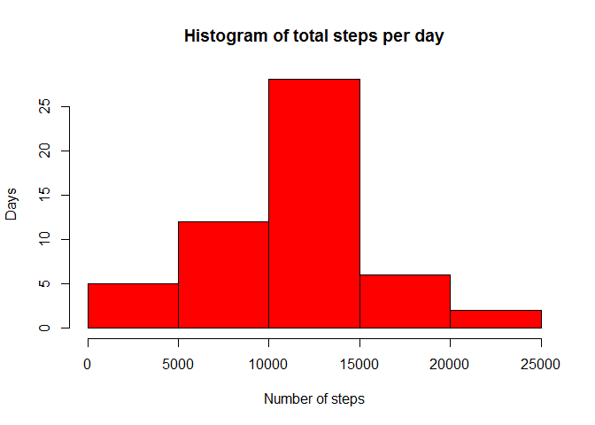

# Reproducible Research: Peer Assessment 1
Set locale so that names of weekdays appear in English,

```r
Sys.setlocale("LC_TIME", "C")
```
and load the neccessary libraries.

```r
library(data.table)
library(ggplot2)
```


## Loading and preprocessing the data
Extract the 'activity.csv' file from the zipfile

```r
unzip(zipfile = 'activity.zip')
```
Read data into a data table and convert the date into POSIXct

```r
activityData <- fread('activity.csv')
activityData[, date := as.POSIXct(activityData[, date], format="%Y-%m-%d")]
```


## What is mean total number of steps taken per day?
Aggregate the total number of steps per date into the variable 'totalSteps',
plot a histogram and calculate mean and median of steps per day.

```r
stepsPerDay <- activityData[, list(totalSteps = sum(steps)), by = date]
hist(stepsPerDay$totalSteps, 
     col  = 'Red',
     main = 'Histogram of total steps per day',
     xlab = 'Number of steps',
     ylab = 'Days'
)
```

 

```r
meanStepsPerDay   <- as.integer(stepsPerDay[, mean(totalSteps, na.rm = TRUE)])
medianStepsPerDay <- stepsPerDay[, median(totalSteps, na.rm = TRUE)]
```
Mean number of steps per day:   10766.   
Median number of steps per day: 10765.

## What is the average daily activity pattern?


## Imputing missing values


## Are there differences in activity patterns between weekdays and weekends?
